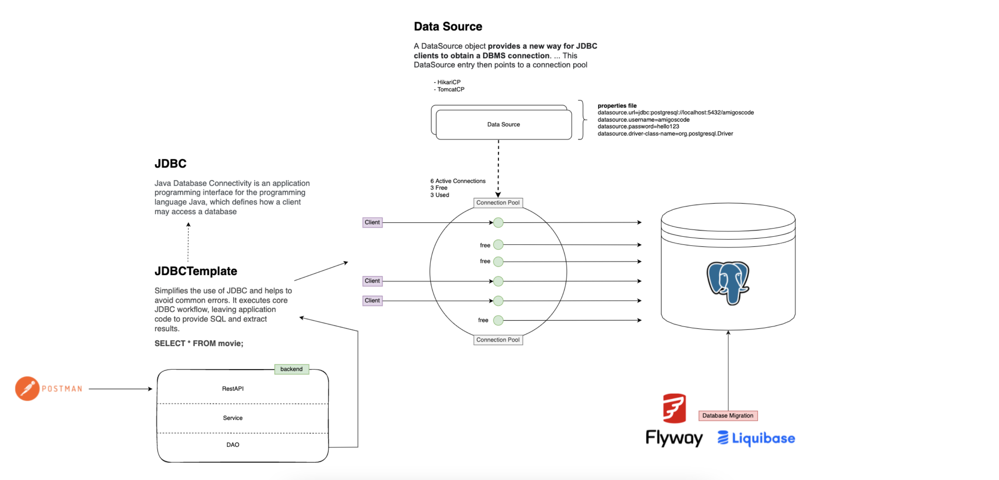

# Working with Databases in Java
- Docker
- JDBC
- Datasource
- Connection Pool
- Flyway and JDBC Template


 ## Diagram



# Exercise

- Add the ability to edit movies
- Add `actor` table and associate them with movies
  You will need to create a new migration called: `V1__ActorTable.sql` and the following sql to create the actor table
```sql
CREATE TABLE actor
(
    id    bigserial primary key,
    name  TEXT NOT NULL,
    movie bigint REFERENCES movie (id),
    unique (name, movie)
);
```